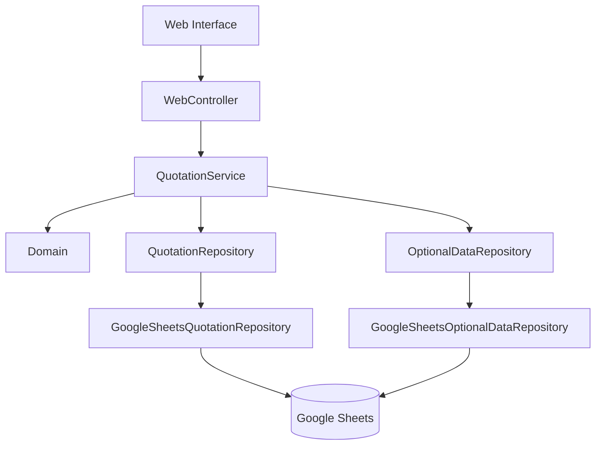
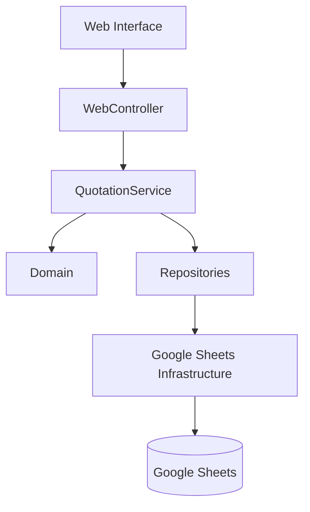

<div align="center">

# ✦ MAIKEISE QUOTATIONS ✦

### Sistema de Gestão e Pesquisa de Cotações  
### Quotation Management & Search System

<br>

**Uma necessidade real transformada em uma solução real.**  
**A real business need turned into a real solution.**

<br>


<br>


<br>

[🇧🇷 Português](#-português) • [🇺🇸 English](#-english) • [📚 Documentação](#-documentação) • [🗺️ Roadmap](#️-roadmap)

</div>

---

# 🇧🇷 Português

## ✨ Sobre o projeto

**Maikeise Quotations** é uma aplicação web desenvolvida pela **Maikeise** para registrar, organizar e consultar cotações comerciais de maneira simples, estruturada e acessível.

O projeto nasceu de uma necessidade real: substituir a consulta manual em um acervo histórico de documentos por uma solução capaz de centralizar informações importantes e localizá-las rapidamente através de uma interface web.

A primeira versão foi entregue em **16 de setembro de 2026** e representa o primeiro release oficial do projeto.

> ### `v1.0.0`
> **Concluída • Entregue • Estável para o escopo inicial**

---

## 💡 O problema

Antes do sistema, a consulta dependia de pesquisa manual em documentos e registros históricos.

Isso tornava tarefas simples mais demoradas:

```text
Encontrar uma cotação
        ↓
Procurar documentos
        ↓
Localizar o item correto
        ↓
Conferir informações
        ↓
Repetir o processo quando necessário
```

O objetivo do projeto foi transformar esse fluxo em:

```text
Pesquisar
   ↓
Encontrar
   ↓
Visualizar
```

---

## 🚀 O que a v1.0.0 entrega

<table>
<tr>
<td width="50%">

### 📝 Cadastro

- Cadastro estruturado de cotações
- Validação de campos obrigatórios
- Cálculo automático de valor total
- NCM
- Prazo de entrega em dias
- Prazo de pagamento em dias
- Data solicitada
- Dados de entrega

</td>
<td width="50%">

### 🔎 Consulta

- Pesquisa por **RFP**
- Pesquisa por **Código do item**
- Alternância entre os dois critérios
- Retorno de múltiplos resultados
- Estado de carregamento
- Estado sem resultados
- Tratamento de erros

</td>
</tr>

<tr>
<td width="50%">

### 📦 Informações adicionais

- Responsável
- Região
- Centro
- Moeda
- Impostos
- Observações
- Persistência flexível por chave e valor

</td>
<td width="50%">

### 👁️ Ver detalhes

- Identificação
- Fornecedor
- Descrição
- Valores
- Informações comerciais
- Dados adicionais
- Status
- Identificadores técnicos ocultos do usuário

</td>
</tr>
</table>

---

## 🎨 Interface

A interface foi pensada para ser:

- limpa;
- corporativa;
- confortável para uso diário;
- responsiva;
- acessível;
- simples para usuários não técnicos;
- visualmente consistente com a identidade da Maikeise.

### Paleta principal

| Cor | Hex | Uso |
|---|---|---|
| 🟦 Azul petróleo | `#203740` | Identidade, títulos e ações principais |
| 🟨 Dourado | `#F2A81D` | Destaques e acentos |
| ⬜ Cinza claro | `#F2F2F2` | Fundo e superfícies |

A aplicação também possui suporte a:

- 🇧🇷 Português
- 🇺🇸 Inglês
- navegação responsiva;
- estados de foco;
- `prefers-reduced-motion`;
- mensagens de sucesso, erro, carregamento e ausência de resultados.

---

## 🧠 Arquitetura

O projeto foi estruturado para evitar que a interface web conheça diretamente a persistência.



### Fluxo principal

```text
Cadastro
   ↓
Validação
   ↓
Application Service
   ↓
Repository
   ↓
Google Sheets
   ↓
Consulta
   ↓
Resultados
   ↓
Detalhes
```

---

## 🧩 Stack

| Área | Tecnologia |
|---|---|
| Frontend | HTML, CSS, JavaScript |
| Backend | Google Apps Script |
| Persistência | Google Sheets |
| Versionamento | Git + GitHub |
| Deploy | Google Apps Script Web App |
| Documentação | Markdown |

A stack foi escolhida para manter:

- baixo custo operacional;
- implantação simples;
- manutenção acessível;
- boa velocidade de desenvolvimento;
- possibilidade de evolução futura.

---

## 📂 Estrutura do projeto

```text
maikeise-quotations/
│
├── docs/
│   ├── adr/
│   ├── design/
│   ├── sprints/
│   └── README.md
│
├── src/
│   ├── application/
│   ├── domain/
│   ├── infrastructure/
│   └── web/
│
├── tests/
│   └── domain/
│
├── .env.example
├── .gitignore
├── CHANGELOG.md
└── README.md
```

---

## 📚 Documentação

A documentação técnica completa está em [`docs/`](docs/).

Ela inclui:

| Documento | Status |
|---|---|
| DDD / Pré-Projeto | ✅ |
| ADR-001 | ✅ |
| Design System | ✅ |
| Sprint 00 | ✅ |
| Sprint 01 | ✅ |
| Sprint 02 | ✅ |
| Changelog | ✅ |

➡️ **[Abrir documentação técnica](docs/README.md)**  
➡️ **[Abrir changelog](CHANGELOG.md)**

---

## 🔐 Segurança e privacidade

Este repositório deve conter apenas **código-fonte e documentação técnica**.

Não devem ser versionados:

- dados reais de cotações;
- informações reais de fornecedores;
- credenciais;
- tokens;
- IDs privados de planilhas;
- Script IDs;
- URLs privadas de deployment;
- dados comerciais sensíveis.

Os exemplos utilizados na documentação e nos testes devem permanecer fictícios.

---

# 🗺️ Roadmap

A `v1.0.0` atende ao escopo da primeira entrega.

Os itens abaixo são **possíveis evoluções**, e não requisitos pendentes da versão entregue.

### Gestão

- [ ] Editar cotações existentes
- [ ] Desativar cotações
- [ ] Histórico visual de alterações
- [ ] Auditoria expandida

### Pesquisa

- [ ] Filtros avançados
- [ ] Pesquisa parcial
- [ ] Ordenação de resultados
- [ ] Paginação

### Dados

- [ ] Importação de acervo histórico
- [ ] OCR e digitalização de documentos
- [ ] Rotinas de exportação
- [ ] Backups automatizados

### Evolução do produto

- [ ] Perfis e permissões
- [ ] Dashboards
- [ ] Indicadores
- [ ] Notificações
- [ ] Integrações externas
- [ ] Migração da persistência caso o projeto ultrapasse os limites adequados ao Google Sheets

---

## 🏷️ Versionamento

```text
v1.0.0  → Primeira versão oficial entregue
v1.0.x  → Correções
v1.x.0  → Novas funcionalidades compatíveis
v2.0.0  → Mudanças significativas de produto ou arquitetura
```

As versões entregues devem permanecer preservadas através de **Git tags**.

---

## 💛 Uma nota pessoal

Este projeto tem um significado muito especial para mim.

Ele começou com uma necessidade real e passou por todas as etapas que transformam uma ideia em software: entendimento do problema, requisitos, arquitetura, domínio, código, erros, testes, mudanças de escopo, interface, documentação e entrega.

Ver tudo isso funcionando — e principalmente ver o cliente feliz com o resultado — me deixa extremamente feliz e orgulhosa.

O **Maikeise Quotations** representa muito mais do que uma aplicação finalizada. Ele representa uma etapa importante da minha evolução como desenvolvedora e também o começo do que quero construir com a **Maikeise**.

Espero que esse projeto ajude a abrir muitas portas.

Que venham novos sistemas.  
Novos clientes.  
Novos desafios.  
Novas ideias.  
E projetos cada vez maiores.

> **Que a v1.0.0 seja menos um ponto final e mais o primeiro marco de muitos futuros.**

---

## 👩‍💻 Projeto

| | |
|---|---|
| **Organização** | Maikeise |
| **Projeto** | Maikeise Quotations |
| **Responsável técnica** | Anny Maikeise |
| **Primeira entrega** | 16 de setembro de 2026 |
| **Release atual** | `v1.0.0` |
| **Status** | ✅ Concluído / Entregue |

---

# 🇺🇸 English

## ✨ About

**Maikeise Quotations** is a web application developed by **Maikeise** to make commercial quotation registration, organization and retrieval simpler, structured and accessible.

The project started from a real business need: replacing manual searches through historical records with a solution capable of centralizing quotation information and making it quickly searchable through a web interface.

The first official release was delivered on **September 16, 2026**.

> ### `v1.0.0`
> **Completed • Delivered • Stable for the initial scope**

---

## 🚀 Main features

- Structured quotation registration
- Required-field validation
- Automatic total calculation
- Additional quotation information
- Search by **RFP**
- Search by **Item Code**
- Multiple matching results
- Complete quotation detail view
- Portuguese and English support
- Responsive interface
- Google Sheets persistence
- Layered architecture

---

## 🧠 Architecture



The web interface does not access the spreadsheet directly.

---

## 🧩 Technology stack

| Area | Technology |
|---|---|
| Frontend | HTML, CSS, JavaScript |
| Backend | Google Apps Script |
| Persistence | Google Sheets |
| Version Control | Git + GitHub |
| Deployment | Google Apps Script Web App |
| Documentation | Markdown |

---

## 🔭 Future improvements

The items below are possible future improvements and are **not unfinished requirements of v1.0.0**.

- [ ] Quotation editing
- [ ] Quotation deactivation
- [ ] Audit history
- [ ] Advanced filters
- [ ] Partial search
- [ ] Sorting
- [ ] Pagination
- [ ] Historical data import
- [ ] OCR and document digitization
- [ ] Export and backup routines
- [ ] Access profiles and permissions
- [ ] Dashboards and indicators
- [ ] External integrations
- [ ] Persistence migration if the project outgrows Google Sheets

---

## 💛 A personal note

This project means a lot to me.

It started as a real problem and became requirements, architecture, domain modeling, code, debugging, tests, scope changes, interface design, documentation and finally a real delivery.

Seeing the system working — and seeing the client happy with it — makes me genuinely proud.

**Maikeise Quotations** represents more than a finished application. It represents an important step in my growth as a developer and the beginning of what I want to build with **Maikeise**.

I hope this project opens many doors.

More systems.  
More clients.  
More challenges.  
More ideas.  
And increasingly ambitious projects.

> **May v1.0.0 be less of an ending and more of the first milestone of many futures.**

---

## 🔐 Repository notice

This repository contains source code and technical documentation.

Real quotation records, supplier information, credentials, tokens, Spreadsheet IDs, Apps Script IDs, private deployment URLs and confidential commercial data are intentionally excluded from version control.

---

<div align="center">

## ✦ MAIKEISE ✦

### Software • Systems • Solutions

**From a real need to a real solution.**

<br>

`Built with care. Designed to evolve.`

</div>
